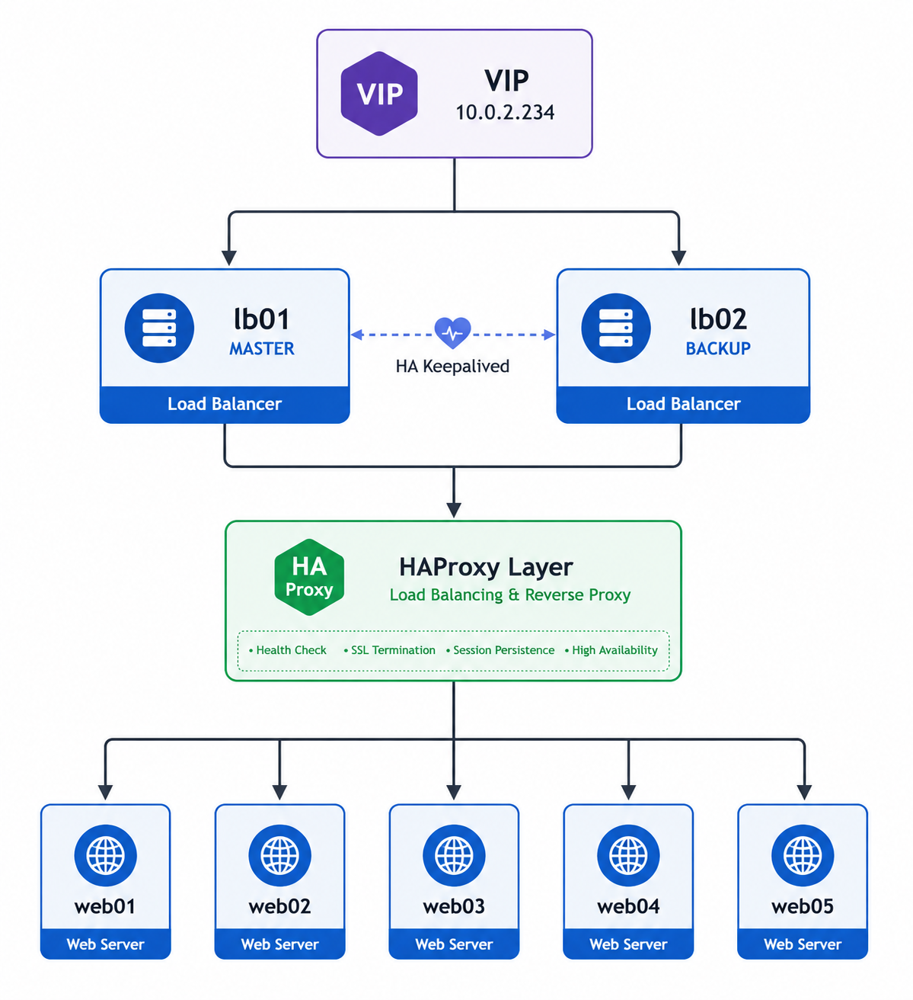
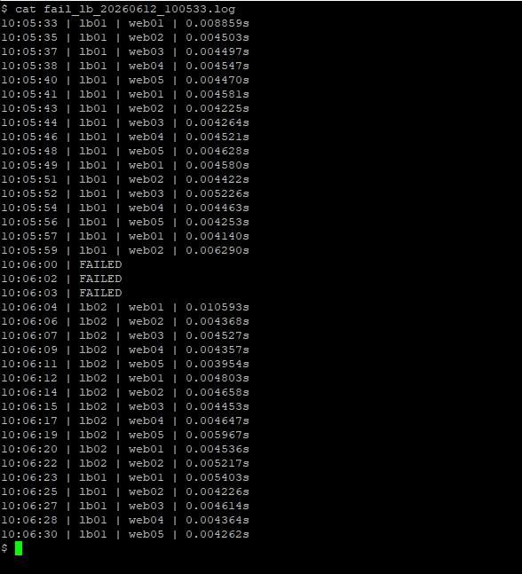

# High Availability Load Balancer Homelab

Production-style homelab project built to learn Infrastructure Automation, Load Balancing, and High Availability concepts using Ansible.

---

# Overview

This project simulates a highly available web platform consisting of:

* 2 HAProxy Load Balancers
* 5 Nginx Backend Servers
* Keepalived Virtual IP Failover
* Ansible Automation

The objective is to understand how production environments handle redundancy, failover, configuration management, and infrastructure recovery.

---

# Architecture

```text
                    VIP
                10.0.2.234
                      |
          +-----------+-----------+
          |                       |
       lb01                    lb02
      MASTER                  BACKUP
          |                       |
          +-----------+-----------+
                      |
                HAProxy Layer
                      |
       +------+------+------+------+------+
       |      |      |      |      |
     web01  web02  web03  web04  web05
```

---

# Features

* Infrastructure as Code (IaC)
* Inventory Driven Configuration
* Automated Nginx Deployment
* Automated HAProxy Deployment
* Automated Keepalived Deployment
* HAProxy Backend Auto-Discovery
* Virtual IP (VIP) Failover
* Active / Passive Load Balancer Architecture
* Configuration Drift Recovery
* Health Check Based Failover

---

# Infrastructure

## Load Balancers

| Host | Role   |
| ---- | ------ |
| lb01 | MASTER |
| lb02 | BACKUP |

---

## Backend Servers

| Host  |
| ----- |
| web01 |
| web02 |
| web03 |
| web04 |
| web05 |

---

# Repository Structure

```text
.
├── inventories
├── playbooks
├── roles
│   ├── nginx
│   ├── haproxy
│   └── keepalived
├── docs
└── README.md
```

---

# Deployment

Deploy entire environment:

```bash
ansible-playbook playbooks/site.yml -K
```

Deploy HAProxy only:

```bash
ansible-playbook playbooks/haproxy.yml -K
```

Deploy Keepalived only:

```bash
ansible-playbook playbooks/keepalived.yml -K
```

---

# Failover Validation

Traffic generation script:

```bash
./fail-lb.sh
```

Simulate failure:

```bash
systemctl stop haproxy
```

Expected sequence:

1. HAProxy process stops
2. Keepalived health check detects failure
3. Priority drops
4. VIP migrates to backup node
5. Traffic resumes through backup load balancer

---

# Failover Evidence

## Topology



---

## Failover Test Result



---

## Raw Failover Log

Available at:

```text
docs/fail_lb_20260612_100533.log
```
---

# Observed Results

Successful failover observed.

Example:

```text
10:06:00 | FAILED
10:06:02 | FAILED
10:06:03 | FAILED
10:06:04 | lb02 | web01
```

Result:

* VIP migrated successfully
* Traffic resumed automatically
* Temporary interruption observed during VRRP election

Observed behavior:

```text
- HAProxy on MASTER failed
- Keepalived detected service failure
- VIP migrated to BACKUP node
- Traffic resumed automatically

Observed downtime:
~3-5 seconds
```

---

# Current Keepalived Tuning

```text
interval = 1
fall = 1
rise = 1
advert_int = 1
weight = -150
```

Purpose:

* Faster HAProxy failure detection
* Faster VIP migration
* Reduced failover downtime

---

# Lessons Learned

This project provided hands-on experience with:

* Linux Administration
* Ansible Roles
* Jinja2 Templates
* HAProxy Load Balancing
* Keepalived
* VRRP
* Virtual IP Management
* Infrastructure Recovery
* Configuration Drift Remediation
* High Availability Design

---

# Future Improvements

* Terraform Proxmox Provider
* Automated LXC Provisioning
* Dynamic Inventory
* Prometheus Monitoring
* Grafana Dashboards
* CI/CD Validation Pipeline
* Multi-Service Failover Testing

---

# Project Status

Current Status:

✅ Completed

Infrastructure successfully supports:

* Automated Deployment
* Load Balancing
* High Availability
* VIP Failover
* Configuration Recovery

Built as part of an ongoing DevOps Homelab Journey.

